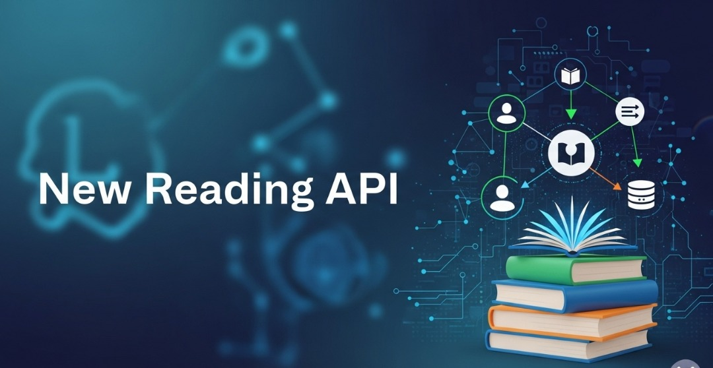

# New Reading API 



Este proyecto proporciona una API completa para gestionar diversas entidades como autores, libros, comentarios, reseñas, usuarios y más. Está construido con **[Laravel](https://laravel.com/)**, un robusto framework de PHP.

Puedes ver la versión original de este README en Inglés [aquí](README.md)

## Tabla de Contenidos

- [New Reading API](#new-reading-api)
  - [Tabla de Contenidos](#tabla-de-contenidos)
  - [Características](#características)
  - [Instalación Local](#instalación-local)
    - [Requisitos](#requisitos)
    - [Pasos de Instalación](#pasos-de-instalación)
  - [Ejecutar el Servidor de Desarrollo](#ejecutar-el-servidor-de-desarrollo)
  - [Primeros Pasos con el Panel de Administración](#primeros-pasos-con-el-panel-de-administración)
  - [Documentación de la API (Swagger/OpenAPI)](#documentación-de-la-api-swaggeropenapi)
  - [Roles y Permisos](#roles-y-permisos)
  - [Endpoints de la API y Ejemplos de Uso](#endpoints-de-la-api-y-ejemplos-de-uso)
    - [1. Autenticación](#1-autenticación)
    - [2. Solicitudes Autenticadas](#2-solicitudes-autenticadas)
    - [3. Recursos RESTful Estándar](#3-recursos-restful-estándar)
    - [4. Rutas Anidadas y Específicas](#4-rutas-anidadas-y-específicas)

## Características

* **API RESTful:** Proporciona endpoints para Autores, Libros, Comentarios, Reseñas, Usuarios, Etiquetas y Géneros.
* **Panel de Administración Integrado:** Una potente interfaz para gestionar todos los datos de la API.
* **Control de Acceso Basado en Roles (RBAC):** Permisos granulares basados en los roles de los usuarios.
* **Documentación Swagger/OpenAPI:** Genera y visualiza fácilmente la documentación de la API.
* **Endpoints de la API y Ejemplos de Uso:** Guía detallada sobre cómo interactuar con la API.

## Instalación Local

### Requisitos

Para instalar y ejecutar este proyecto localmente, asegúrate de tener lo siguiente instalado en tu máquina:

* **Composer:** 2.7 o superior
* **Git:** 2.34 o superior
* **PHP:** 8.3 o superior
* **Laravel:** 11.x o superior
* **Gestor de Base de Datos:** ej., PostgreSQL

### Pasos de Instalación

1.  **Clona el repositorio:**

    ```bash
    git clone <repo_url>
    cd <project_folder_name> # Navega al directorio clonado
    ```

2.  **Instala las dependencias de PHP:**

    ```bash
    composer install
    ```

3.  **Crea y configura tu archivo de entorno:**

    ```bash
    cp .env.example .env
    ```

    Abre el archivo `.env` recién creado. **Debes** configurar las variables de conexión a tu base de datos (ej., `DB_CONNECTION`, `DB_HOST`, `DB_PORT`, `DB_DATABASE`, `DB_USERNAME`, `DB_PASSWORD`).

    *Importante:* Este proyecto utiliza variables de entorno para las credenciales del usuario administrador por defecto durante el sembrado de la base de datos. Opcionalmente, puedes personalizar `DEFAULT_ADMIN_NAME`, `DEFAULT_ADMIN_EMAIL` y `DEFAULT_ADMIN_PASSWORD` en tu archivo `.env`.

4.  **Genera la clave de la aplicación:**

    ```bash
    php artisan key:generate
    ```

5.  **Ejecuta las migraciones de la base de datos:**

    ```bash
    php artisan migrate
    ```

    En este punto, el proyecto debería estar instalado localmente y el esquema de tu base de datos configurado.

## Ejecutar el Servidor de Desarrollo

Para probar la API y acceder al panel de administración, necesitas ejecutar el servidor de desarrollo de Laravel:

```bash
php artisan serve
```

Por defecto, el servidor se iniciará en `http://localhost:8000`. Ahora puedes acceder a la aplicación en tu navegador y comenzar a hacer solicitudes a la API.

## Primeros Pasos con el Panel de Administración

Para poblar rápidamente tu base de datos con datos de muestra y crear un usuario administrador por defecto para el panel:

1.  **Siembra la base de datos:**

    ```bash
    php artisan db:seed
    ```
    Este comando poblará tu base de datos con datos aleatorios y creará un usuario administrador por defecto basado en las credenciales configuradas en tu archivo `.env` y en `config/admin_user.php`.

2.  **Accede al Panel de Administración:**
    Abre tu navegador web y navega a la página de inicio de sesión del administrador:

    ```
    http://localhost:8000/ad/login
    ```
    Inicia sesión con las credenciales de administrador por defecto. Por ejemplo, si mantuviste los valores por defecto, podría ser `admin@example.com` y `password` (como se define en `config/admin_user.php`).

    Una vez iniciada la sesión, verás una barra lateral que da acceso a varias secciones de gestión de datos:
    * Autores
    * Libros
    * Comentarios
    * Géneros
    * Publicaciones
    * Reseñas
    * Etiquetas
    * Usuarios
    * Roles
    * Permisos

## Documentación de la API (Swagger/OpenAPI)

Para generar y ver la documentación completa de la API:

1.  **Genera los archivos de documentación:**

    ```bash
    php artisan l5-swagger:generate
    ```

2.  **Visualiza la documentación en tu navegador:**

    ```
    http://localhost:8000/api/documentation
    ```

## Roles y Permisos

Este proyecto implementa un robusto sistema de Control de Acceso Basado en Roles (RBAC). Los permisos de los usuarios se determinan dinámicamente por sus roles asignados. Los roles predefinidos en este proyecto incluyen:

* **Admin:** Posee acceso completo y capacidades de gestión integrales en todo el sistema.
* **Editor:** Se centra principalmente en la gestión de contenido, como la actualización de publicaciones, etiquetas y géneros.
* **Moderador:** Responsable de moderar el contenido generado por los usuarios (ej., reseñas, comentarios) y de gestionar a los usuarios.
* **Autor:** Puede crear y gestionar su propio contenido, específicamente publicaciones.
* **Usuario:** Un usuario general, típicamene limitado a ver contenido y a crear/gestionar sus propias reseñas y comentarios.

**Acceso al Panel de Administración:** Para iniciar sesión en el panel de administración, un usuario debe tener asignado uno de los siguientes roles: Admin, Editor o Moderador.

Los roles de los usuarios se pueden gestionar cómodamente a través de la sección "Usuarios" dentro del propio panel de administración.

## Endpoints de la API y Ejemplos de Uso

Esta API ofrece un conjunto de endpoints RESTful para gestionar tus datos. Puedes interactuar con estos endpoints utilizando cualquier cliente HTTP como Postman, Insomnia o incluso `curl`.

**URL Base:** `http://localhost:8000/api` (suponiendo que tu aplicación Laravel se está ejecutando en el puerto 8000)

### 1. Autenticación

La API utiliza Laravel Sanctum para la autenticación de tokens de API.

* **Registrar un nuevo usuario:**
    * **Endpoint:** `POST /register`
    * **Cuerpo (JSON):**
        ```json
        {
            "name": "John Doe",
            "email": "john.doe@example.com",
            "password": "your_strong_password",
            "password_confirmation": "your_strong_password"
        }
        ```

* **Iniciar sesión y obtener un token de API:**
    * **Endpoint:** `POST /login`
    * **Cuerpo (JSON):**
        ```json
        {
            "email": "john.doe@example.com",
            "password": "your_strong_password"
        }
        ```
    * **Respuesta:** Incluirá un `access_token` que usarás para las solicitudes autenticadas.

* **Cerrar sesión (requiere autenticación):**
    * **Endpoint:** `POST /logout`
    * **Cabeceras:** `Authorization: Bearer <your_access_token>`

### 2. Solicitudes Autenticadas

Para la mayoría de los recursos de la API (autores, libros, comentarios, etc.), necesitas estar autenticado. Después de iniciar sesión, recibirás un `access_token`. Incluye este token en la cabecera `Authorization` de todas las solicitudes protegidas posteriores:

* **Cabecera:** `Authorization: Bearer <your_access_token>`

### 3. Recursos RESTful Estándar

La API proporciona operaciones CRUD (Crear, Leer, Actualizar, Eliminar) estándar para los siguientes recursos: `authors`, `books`, `comments`, `genres`, `posts`, `users`, `tags` y `reviews`.

**Ejemplo: Gestión de Autores**

* **Obtener todos los autores:**
    * **Endpoint:** `GET /authors`
    * **Cabeceras:** `Authorization: Bearer <token>`

* **Obtener un solo autor:**
    * **Endpoint:** `GET /authors/{author_id}`
    * **Cabeceras:** `Authorization: Bearer <token>`

* **Crear un nuevo autor:**
    * **Endpoint:** `POST /authors`
    * **Cabeceras:**
        * `Authorization: Bearer <token>`
        * `Content-Type: application/json`
    * **Cuerpo (JSON):**
        ```json
        {
            "name": "Jane Austen"
        }
        ```

* **Actualizar un autor:**
    * **Endpoint:** `PUT /authors/{author_id}`
    * **Cabeceras:**
        * `Authorization: Bearer <token>`
        * `Content-Type: application/json`
    * **Cuerpo (JSON):**
        ```json
        {
            "name": "Jane Austen Updated"
        }
        ```

* **Eliminar un autor:**
    * **Endpoint:** `DELETE /authors/{author_id}`
    * **Cabeceras:** `Authorization: Bearer <token>`

### 4. Rutas Anidadas y Específicas

Muchos recursos tienen rutas anidadas para gestionar sus relaciones o realizar acciones específicas.

* **Operaciones relacionadas con libros:**
    * `POST /books/{book_id}/comments`: Añadir un comentario a un libro específico.
    * `GET /books/{book_id}/posts`: Obtener publicaciones relacionadas con un libro específico.
    * `POST /books/{book_id}/posts`: Crear una nueva publicación para un libro específico.
    * `PUT /books/{book_id}/tags`: Actualizar las etiquetas asociadas a un libro (requiere una lista de IDs de etiquetas en el cuerpo).
    * `PUT /books/{book_id}/reading-progress`: Actualizar el progreso de lectura de un usuario para un libro (ej., `{"progress": 75}`).
    * `GET /books/{book_id}/reviews`: Obtener reseñas de un libro específico.
    * `POST /books/{book_id}/reviews`: Añadir una reseña a un libro específico.

* **Operaciones relacionadas con publicaciones:**
    * `GET /posts/{post_id}/comments`: Obtener comentarios de una publicación específica.
    * `POST /posts/{post_id}/comments`: Añadir un comentario a una publicación específica.

* **Operaciones relacionadas con reseñas:**
    * `GET /reviews/{review_id}/comments`: Obtener comentarios de una reseña específica.
    * `POST /reviews/{review_id}/comments`: Añadir un comentario a una reseña específica.
    * `POST /reviews/{review_id}/like`: Dar "me gusta" a una reseña.
    * `POST /reviews/{review_id}/dislike`: Dar "no me gusta" a una reseña.

* **Operaciones relacionadas con usuarios:**
    * `GET /users/{user_id}/reviews`: Obtener reseñas escritas por un usuario específico.
    * `GET /users/{user_id}/posts`: Obtener publicaciones creadas por un usuario específico.
    * `POST /users/{user_id}/posts`: Crear una nueva publicación para un usuario específico.
    * `POST /users/{user_id}/follow`: Seguir a otro usuario.
    * `DELETE /users/{user_id}/unfollow`: Dejar de seguir a otro usuario.

**Uso de Postman/Insomnia:**

1.  Establece el **Método HTTP** (GET, POST, PUT, DELETE).
2.  Introduce la **URL de la Solicitud** (ej., `http://localhost:8000/api/authors`).
3.  Para solicitudes autenticadas, ve a la pestaña **Headers** y añade `Authorization` como clave y `Bearer <your_access_token>` como valor.
4.  Para solicitudes POST/PUT con un cuerpo JSON, ve a la pestaña **Headers** y añade `Content-Type: application/json`. Luego, ve a la pestaña **Body**, selecciona `raw` y `JSON`, y pega tu carga útil JSON.
5.  Haz clic en **Send**.