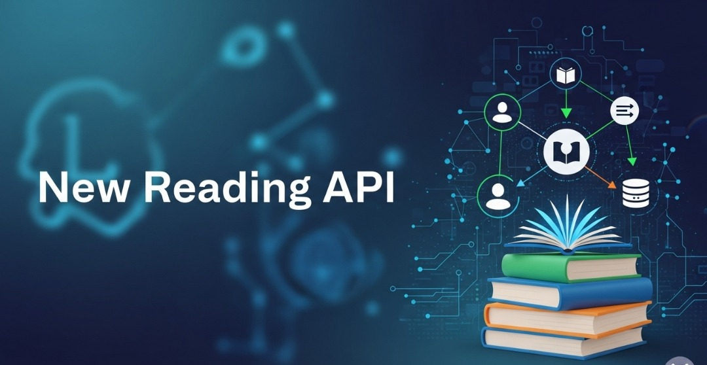

# New Reading API



This project provides a comprehensive API for managing various entities such as authors, books, comments, reviews, users, and more. It is built using **[Laravel](https://laravel.com/)**, a robust PHP framework.

You can find a Spanish version of this README [here](README.es.md)

## Table of Contents

- [New Reading API](#new-reading-api)
  - [Table of Contents](#table-of-contents)
  - [Features](#features)
  - [Local Installation](#local-installation)
    - [Requirements](#requirements)
    - [Installation Steps](#installation-steps)
  - [Running the Development Server](#running-the-development-server)
  - [Getting Started with the Admin Panel](#getting-started-with-the-admin-panel)
  - [API Documentation (Swagger/OpenAPI)](#api-documentation-swaggeropenapi)
  - [Roles and Permissions](#roles-and-permissions)
  - [API Endpoints \& Usage Examples](#api-endpoints--usage-examples)
    - [1. Authentication](#1-authentication)
    - [2. Authenticated Requests](#2-authenticated-requests)
    - [3. Standard RESTful Resources](#3-standard-restful-resources)
    - [4. Nested \& Specific Routes](#4-nested--specific-routes)

## Features

* **RESTful API:** Provides endpoints for Authors, Books, Comments, Reviews, Users, Tags, and Genres.
* **Integrated Admin Panel:** A powerful interface for managing all API data.
* **Role-Based Access Control (RBAC):** Granular permissions based on user roles.
* **Swagger/OpenAPI Documentation:** Easily generate and view API documentation.
* **API Endpoints & Usage Examples:** Detailed guide on how to interact with the API.

## Local Installation

### Requirements

To install and run this project locally, ensure you have the following installed on your machine:

* **Composer:** 2.7 or higher
* **Git:** 2.34 or higher
* **PHP:** 8.3 or higher
* **Laravel:** 11.x or higher
* **Database Manager:** e.g., PostgreSQL

### Installation Steps

1.  **Clone the repository:**

    ```bash
    git clone <repo_url>
    cd <project_folder_name> # Navigate into the cloned directory
    ```

2.  **Install PHP dependencies:**

    ```bash
    composer install
    ```

3.  **Create and configure your environment file:**

    ```bash
    cp .env.example .env
    ```

    Open the newly created `.env` file. You **must** configure your database connection variables (e.g., `DB_CONNECTION`, `DB_HOST`, `DB_PORT`, `DB_DATABASE`, `DB_USERNAME`, `DB_PASSWORD`).

    *Important:* This project utilizes environment variables for default admin user credentials during database seeding. You can optionally customize `DEFAULT_ADMIN_NAME`, `DEFAULT_ADMIN_EMAIL`, and `DEFAULT_ADMIN_PASSWORD` in your `.env` file.

4.  **Generate application key:**

    ```bash
    php artisan key:generate
    ```

5.  **Run database migrations:**

    ```bash
    php artisan migrate
    ```

    At this point, the project should be installed locally and your database schema set up.

## Running the Development Server

To test the API and access the admin panel, you need to run the Laravel development server:

```bash
php artisan serve
```

By default, the server will start on `http://localhost:8000`. You can now access the application in your browser and start making requests to the API.

## Getting Started with the Admin Panel

To quickly populate your database with sample data and create a default admin user for the panel:

1.  **Seed the database:**

    ```bash
    php artisan db:seed
    ```
    This command will populate your database with random data and create a default admin user based on the credentials configured in your `.env` file and `config/admin_user.php`.

2.  **Access the Admin Panel:**
    Open your web browser and navigate to the admin login page:

    ```
    http://localhost:8000/ad/login
    ```
    Log in using the default admin credentials. For example, if you kept the defaults, it might be `admin@example.com` and `password` (as defined in `config/admin_user.php`).

    Once logged in, you will see a sidebar providing access to various data management sections:
    * Authors
    * Books
    * Comments
    * Genres
    * Posts
    * Reviews
    * Tags
    * Users
    * Roles
    * Permissions

## API Documentation (Swagger/OpenAPI)

To generate and view the comprehensive API documentation:

1.  **Generate documentation files:**

    ```bash
    php artisan l5-swagger:generate
    ```

2.  **View documentation in your browser:**

    ```
    http://localhost:8000/api/documentation
    ```

## Roles and Permissions

This project implements a robust Role-Based Access Control (RBAC) system. User permissions are dynamically determined by their assigned roles. The predefined roles in this project include:

* **Admin:** Possesses full access and comprehensive management capabilities across the entire system.
* **Editor:** Primarily focused on content management, such as updating posts, tags, and genres.
* **Moderator:** Responsible for moderating user-generated content (e.g., reviews, comments) and managing users.
* **Author:** Can create and manage their own content, specifically posts.
* **User:** A general user, typically limited to viewing content and creating/managing their own reviews and comments.

**Admin Panel Access:** To log into the admin panel, a user must be assigned one of the following roles: Admin, Editor, or Moderator.

User roles can be conveniently managed via the "Users" section within the admin panel itself.

## API Endpoints & Usage Examples

This API offers a set of RESTful endpoints to manage your data. You can interact with these endpoints using any HTTP client like Postman, Insomnia, or even `curl`.

**Base URL:** `http://localhost:8000/api` (assuming your Laravel app is running on port 8000)

### 1. Authentication

The API uses Laravel Sanctum for API token authentication.

* **Register a new user:**
    * **Endpoint:** `POST /register`
    * **Body (JSON):**
        ```json
        {
            "name": "John Doe",
            "email": "john.doe@example.com",
            "password": "your_strong_password",
            "password_confirmation": "your_strong_password"
        }
        ```

* **Log in and get an API token:**
    * **Endpoint:** `POST /login`
    * **Body (JSON):**
        ```json
        {
            "email": "john.doe@example.com",
            "password": "your_strong_password"
        }
        ```
    * **Response:** Will include an `access_token` that you'll use for authenticated requests.

* **Log out (requires authentication):**
    * **Endpoint:** `POST /logout`
    * **Headers:** `Authorization: Bearer <your_access_token>`

### 2. Authenticated Requests

For most API resources (authors, books, comments, etc.), you need to be authenticated. After logging in, you'll receive an `access_token`. Include this token in the `Authorization` header of all subsequent protected requests:

* **Header:** `Authorization: Bearer <your_access_token>`

### 3. Standard RESTful Resources

The API provides standard CRUD (Create, Read, Update, Delete) operations for the following resources: `authors`, `books`, `comments`, `genres`, `posts`, `users`, `tags`, and `reviews`.

**Example: Managing Authors**

* **Get all authors:**
    * **Endpoint:** `GET /authors`
    * **Headers:** `Authorization: Bearer <token>`

* **Get a single author:**
    * **Endpoint:** `GET /authors/{author_id}`
    * **Headers:** `Authorization: Bearer <token>`

* **Create a new author:**
    * **Endpoint:** `POST /authors`
    * **Headers:**
        * `Authorization: Bearer <token>`
        * `Content-Type: application/json`
    * **Body (JSON):**
        ```json
        {
            "name": "Jane Austen"
        }
        ```

* **Update an author:**
    * **Endpoint:** `PUT /authors/{author_id}`
    * **Headers:**
        * `Authorization: Bearer <token>`
        * `Content-Type: application/json`
    * **Body (JSON):**
        ```json
        {
            "name": "Jane Austen Updated"
        }
        ```

* **Delete an author:**
    * **Endpoint:** `DELETE /authors/{author_id}`
    * **Headers:** `Authorization: Bearer <token>`

### 4. Nested & Specific Routes

Many resources have nested routes to manage their relationships or perform specific actions.

* **Book-related operations:**
    * `POST /books/{book_id}/comments`: Add a comment to a specific book.
    * `GET /books/{book_id}/posts`: Get posts related to a specific book.
    * `POST /books/{book_id}/posts`: Create a new post for a specific book.
    * `PUT /books/{book_id}/tags`: Update tags associated with a book (requires a list of tag IDs in the body).
    * `PUT /books/{book_id}/reading-progress`: Update a user's reading progress for a book (e.g., `{"progress": 75}`).
    * `GET /books/{book_id}/reviews`: Get reviews for a specific book.
    * `POST /books/{book_id}/reviews`: Add a review for a specific book.

* **Post-related operations:**
    * `GET /posts/{post_id}/comments`: Get comments for a specific post.
    * `POST /posts/{post_id}/comments`: Add a comment to a specific post.

* **Review-related operations:**
    * `GET /reviews/{review_id}/comments`: Get comments for a specific review.
    * `POST /reviews/{review_id}/comments`: Add a comment to a specific review.
    * `POST /reviews/{review_id}/like`: Like a review.
    * `POST /reviews/{review_id}/dislike`: Dislike a review.

* **User-related operations:**
    * `GET /users/{user_id}/reviews`: Get reviews written by a specific user.
    * `GET /users/{user_id}/posts`: Get posts created by a specific user.
    * `POST /users/{user_id}/posts`: Create a new post for a specific user.
    * `POST /users/{user_id}/follow`: Follow another user.
    * `DELETE /users/{user_id}/unfollow`: Unfollow another user.

**Using Postman/Insomnia:**

1.  Set the **HTTP Method** (GET, POST, PUT, DELETE).
2.  Enter the **Request URL** (e.g., `http://localhost:8000/api/authors`).
3.  For authenticated requests, go to the **Headers** tab and add `Authorization` as a key and `Bearer <your_access_token>` as the value.
4.  For POST/PUT requests with a JSON body, go to the **Headers** tab and add `Content-Type: application/json`. Then, go to the **Body** tab, select `raw` and `JSON`, and paste your JSON payload.
5.  Click **Send**.